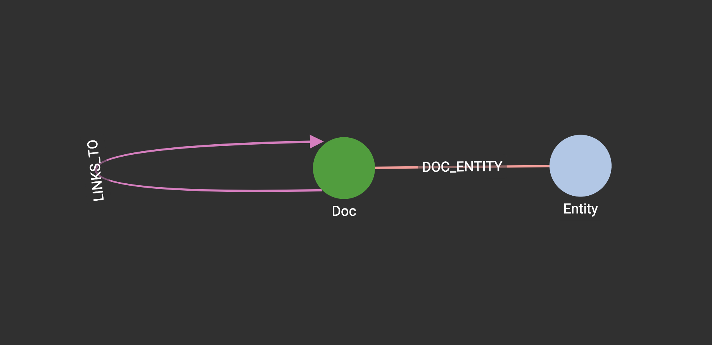
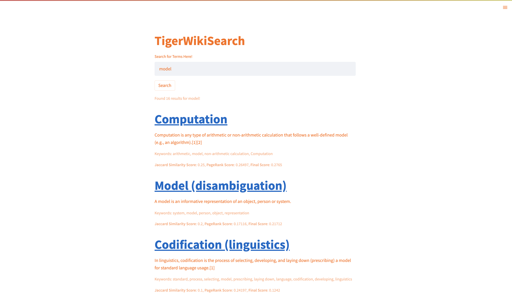

# TigerWikiEntitySearch

## Quickstart

1. Clone this repository
1. Create the WikiGraph graph and connect to it in `index.py`
1. [Optional] Create a virtual environment with `python3 -m venv venv`
1. Install the pip packages with `pip3 install -r requirements.txt`
1. Start the application with `streamlit run index.py`

## Overview

This "Google Clone" uses TigerGraph in the backend to search articles based on similarity to original article and connections to other articles. 

The graph database uses the WikiGraph, the schema of which is shown below. 

The dashboard itself is created with Streamlit. When a user inputs a search term, keyword extraction is performed on it. The search term then runs a Jaccard similarity and Pagerank and orders the articles by a weighted summation of the two scores. The results of the query is returned to Streamlit to display. 

